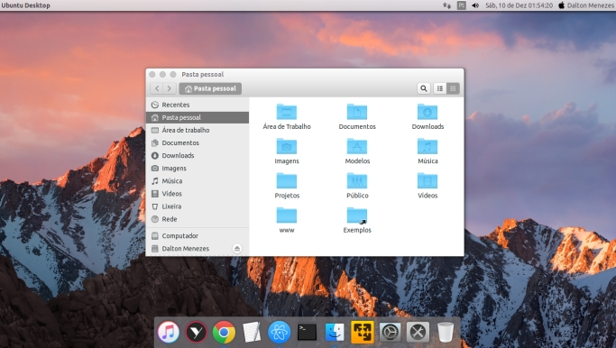

# Mac Theme

This recipe will install and configure:

- MacBuntu icons
- MacBuntu theme
- MacOS X Sierra wallpaper
- Plank dock
- Gnosierra Plank theme
- Albert spotlight `{Shift + Space}` for use it.

# Usage

| Command | Support |
| --- | --- | --- | --- |
| `uni bake daltonmenezes/mac-theme` | Ubuntu 16.04 (Unity) |

# Uninstallation

| Command |
| --- |
| `uni bake daltonmenezes/mac-theme-remove` |

# Author

[Dalton Menezes](https://github.com/uni-linux/recipes/tree/master/src/daltonmenezes)
