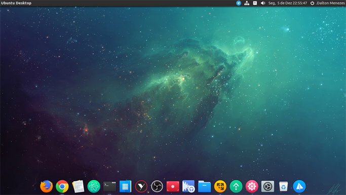

# Nebulosa Theme

This recipe will install and configure:

- El General icons
- Flatabulous theme
- Nebulosa Ghost wallpaper
- Plank dock

Note: Plank only will be installed in Ubuntu 16.04 and only if you don't have it. Other distributions Plank will be ignored during this recipe installation.

# Usage

| Command | Support |
| --- | --- | --- |
| `uni bake daltonmenezes/nebulosa-theme` | Tested on Ubuntu 16.04 and Elementary OS Loki |

# Author

[Dalton Menezes](https://github.com/uni-linux/recipes/tree/master/src/daltonmenezes)
