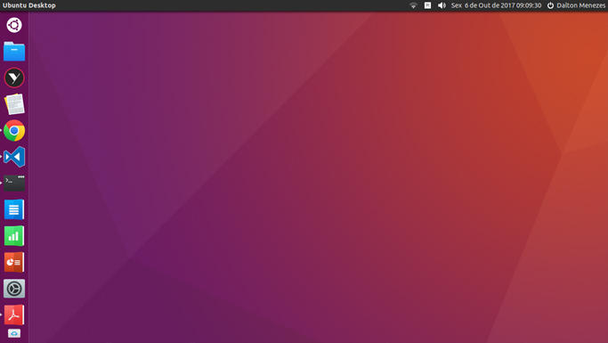

# Stylishbuntu Theme

This recipe will install and configure:

- El General icons
- Flatabulous theme

# Usage

| Command | Support |
| --- | --- |
| `uni bake stylishbuntu-theme` | Ubuntu 16.04 (Unity) |

# Uninstallation

| Command |
| --- |
| `uni bake stylishbuntu-theme-remove` |

# Author

[Dalton Menezes](https://github.com/uni-linux/recipes/tree/master/src/daltonmenezes)
